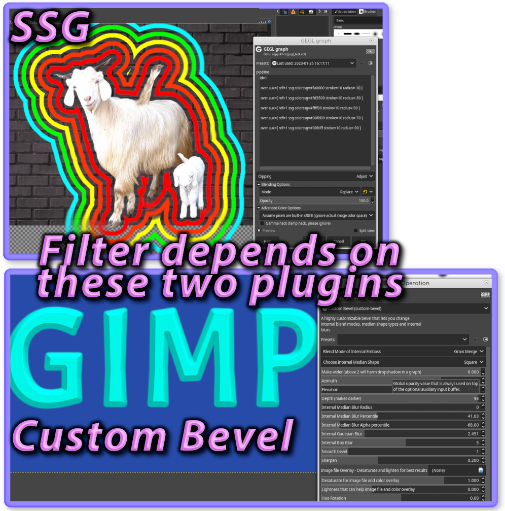

## Ring Bevel Gimp plugin
works in both Gimp 2.10 and Gimp 2.99


In the folder "images" their is the image file sand.png that this calls.
Remember, to make text while or grayscale before uploading an image file.

## Directory to put Binaries (They do NOT go in the normal plugins folder)

**Windows**

 C:\Users\(USERNAME)\AppData\Local\gegl-0.4\plug-ins
 
 **Linux** 

 /home/(USERNAME)/.local/share/gegl-0.4/plug-ins
 
 **Linux (Flatpak includes Chromebook)**

 /home/(USERNAME)/.var/app/org.gimp.GIMP/data/gegl-0.4/plug-ins

Then Restart Gimp and go to GEGL Operations and look for "Ring Bevel" in the drop down list
Gimp 2.99.16+ users will find the filter in Filters>Text Ttyling>Ringed Bevel. 2.10 
users will only see it in the GEGL operations drop down list.


This plugin ships with two other plugins of mine that are useful stand alones on their own. 
Custom Bevel and SSG (stroke shadow glow)



## Compiling and Installing

### Linux

To compile and install you will need the GEGL header files (`libgegl-dev` on
Debian based distributions or `gegl` on Arch Linux) and meson (`meson` on
most distributions).

```bash
meson setup --buildtype=release build
ninja -C build

```

If you have an older version of gegl you may need to copy to `~/.local/share/gegl-0.3/plug-ins`
instead (on Ubuntu 18.04 for example).

BEAVER RECOMMENDS YOU USE A MODERN VERSION OF GEGL. NO GUARANTEE DATED VERSIONS OF GIMP WILL WORK WITH THIS PLUGIN 

### Windows

The easiest way to compile this project on Windows is by using msys2.  Download
and install it from here: https://www.msys2.org/

Open a msys2 terminal with `C:\msys64\mingw64.exe`.  Run the following to
install required build dependencies:

```bash
pacman --noconfirm -S base-devel mingw-w64-x86_64-toolchain mingw-w64-x86_64-meson mingw-w64-x86_64-gegl
```

Then build the same way you would on Linux:

```bash
meson setup --buildtype=release build
ninja -C build
```

## More Image Previews of this amazing plugin


## Stuff to know about this plugin 

1. This plugin was directly inspired by LayerFX's Bevel and Emboss set to "inner" and "double ring". I mimicked that effect in GEGL.

2. It ships and requires two other plugins of mine. Custom Bevel and SSG

3. Recolor mode is disabled in default until a checkbox is enabled. Recolor makes the bevel any color regardless of the original color

4. The Dark Bevel slider is suppose to be used if you are running bevel on a very dark color. Dark colors don't work proper in default and dark bevel slider looks odd if ran on light colors.

5. The LayerFX dev who made Bevel and Emboss's "ring bevel counterpart" way back in 2008 was able to take advantage of Gimp's selection tools via script fu stuff. GEGL can't do this. I had to use my SSG plugin on the erase blend mode to make selections, then apply my custom bevel filter over and behind those selections.

